**Data-Analyst-Numan**
# AWS Data Projects Portfolio

Welcome to my portfolio! This repository contains **five key data projects** illustrating how I used **AWS services**—like **S3**, **AWS Glue DataBrew**, **AWS Glue ETL**, **Amazon Athena**, and **CloudWatch** and various other tools—to perform data ingestion, profiling, cleaning, transformation, analysis, and monitoring.

> **Table of Contents**
> 1. [Exploratory Data Analysis](#1-exploratory-data-analysis)
> 2. [Descriptive Analysis](#2-descriptive-analysis)
> 3. [Diagnostic Analysis](#3-diagnostic-analysis)
> 4. [Data Wrangling](#4-data-wrangling)
> 5. [Data Quality Control & Monitoring](#5-data-quality-control--monitoring)

Project Title: Exploring Temperature-Turbidity Correlation in Vancouver's Water Quality Data

Objective:
The objective of this project is to perform an in-depth Exploratory Data Analysis (EDA) using the City of Vancouver’s water quality dataset. This analysis focuses on investigating the relationship between temperature and turbidity levels in drinking water systems, with the ultimate aim of understanding if temperature fluctuations can act as a predictor for changes in water clarity. This insight can assist in identifying seasonal or environmental influences on water quality.

Dataset:
The dataset includes real-world water quality readings collected by the City of Vancouver. Key attributes include:

Temperature: The recorded water temperature at various monitoring points

Turbidity: A measure of water clarity, where higher values indicate more particles or cloudiness

Operating Permit Number, Facility ID, Sample Date, and other operational metadata

Methodology:

Data Storage & Collection: Data was initially stored in Amazon S3 for centralized access and versioning.

Data Profiling: AWS Glue DataBrew was used to profile the data, identify missing values, check column formats, and inspect outliers.

Data Cleaning: A cleaning recipe was created in DataBrew, which included dropping irrelevant columns (e.g., mechanical, permit status), fixing data types, and removing duplicates.

Analysis: Cleaned data was queried using Amazon Athena to explore:

Correlation between temperature and turbidity

Seasonal trends or time-based changes in turbidity

Distribution and variance of turbidity values across different months and temperature ranges

Data Visualization: Trends were visualized using boxplots, histograms, and scatter plots to observe patterns.

Tools and Technologies:

AWS S3, AWS Glue DataBrew, Amazon Athena

SQL, Data Profiling Tools, Jupyter Notebooks (for visualization and validation)

Deliverables:

A detailed Jupyter Notebook with EDA steps and interpretations

Cleaned dataset in S3

SQL queries and outputs via Athena

Summary dashboard showing visual trends and findings

Key Findings:
The analysis indicated a moderate correlation between increased water temperature and elevated turbidity levels during the summer months. It also uncovered recurring seasonal spikes in turbidity, emphasizing the need for preventive water system maintenance during warm periods.
## 1. Exploratory Data Analysis
**Project Description**: EDA of City of Vancouver water quality data  
**Objective**: Analyze and understand how changes in temperature might affect turbidity levels.

**What I Did**  

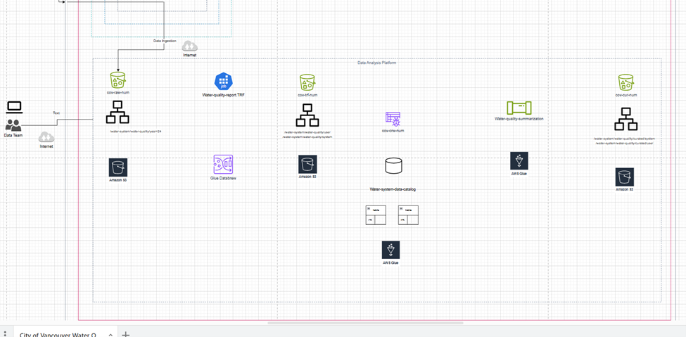

- **Data Storage**: Placed the raw data in **Amazon S3**.  
- **Profiling**: Used **AWS Glue DataBrew** to identify missing values, invalid data types, and duplicate records.

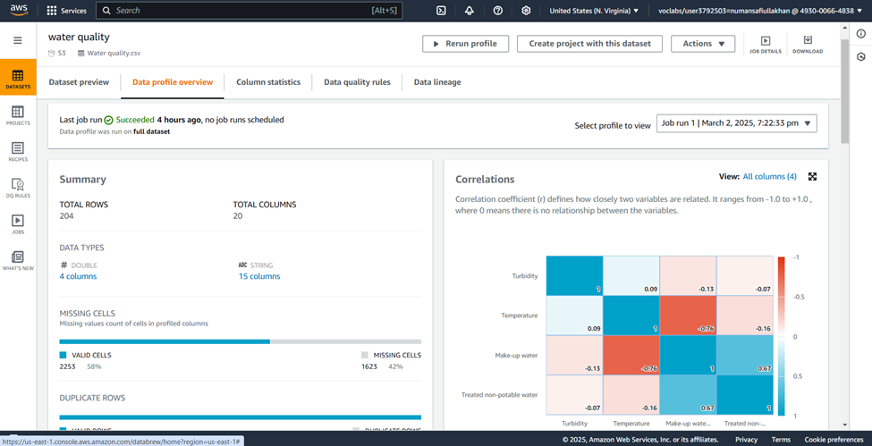

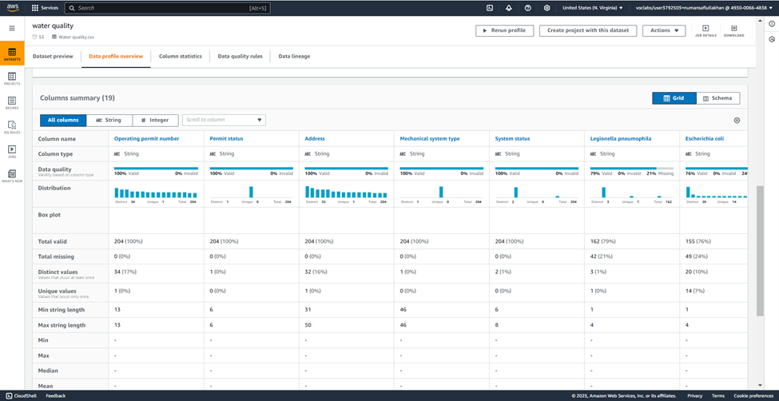

- **Cleaning**: Created a **DataBrew recipe** to drop unnecessary columns (e.g., permit status, mechanical).  
- **Analysis**: Employed **Amazon Athena** to query the cleaned data and answer three business questions:
  1. Correlation between temperature changes and turbidity levels  
  2. Trends in turbidity over specific time periods  
  3. Identification of outlier temperature or turbidity readings
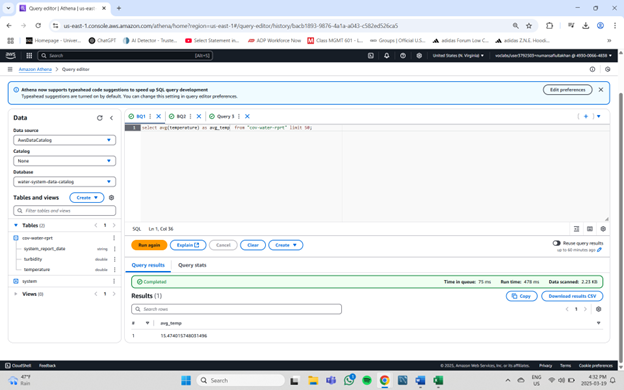

**Key Takeaways**  
- Insight into temperature–turbidity correlations  
- Simplified queries by removing irrelevant columns  
- Demonstrated speed of AWS Glue DataBrew for data profiling and recipe-based cleaning

---

## 2. Descriptive Analysis
**Project Description**: Summarizing Vancouver data using AWS Glue ETL  
**Objective**: Provide a descriptive summary (data cataloging & summarization) **without** deep business queries.

**What I Did**  
- **Data Cataloging**: Created a **Glue Crawler** to automatically detect schemas and populate the **AWS Glue Data Catalog**.

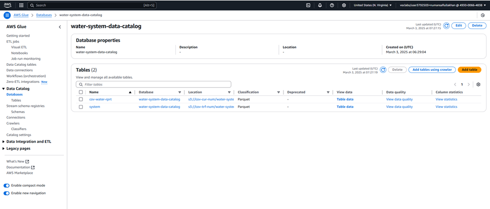

- **Data Summarization**: Built an **AWS Glue ETL** pipeline to transform the dataset (generating aggregated stats like mean, median, count).

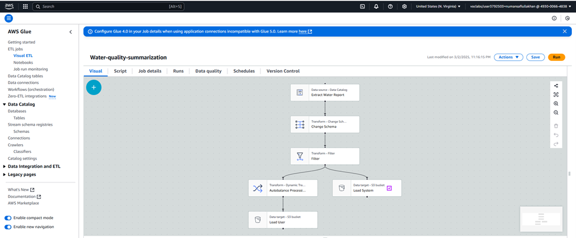

- **Analysis**: This time, *did not* run business questions via Athena; focus was on stable summaries.

**Key Takeaways**  
- Established a robust data catalog for quick data discovery  
- Collected aggregated stats to track high-level trends

<!-- Insert a screenshot or diagram related to Descriptive Analysis:

-->

---

## 3. Diagnostic Analysis
**Project Description**: Investigating underlying issues or anomalies in the Vancouver dataset  
**Objective**: Diagnose potential factors contributing to unusual data patterns (e.g., sudden spikes in turbidity).

**What I Did**  
- **Data Collection & Preparation**: Continued using **AWS Glue** (Crawler + ETL) to unify data.  
- **Trend & Correlation Checks**: Used **DataBrew** to verify data integrity before analyzing.  
- **Root-Cause Insights**: Explored sensor calibration times, missing data segments, etc., for potential anomalies.  
- **Analysis Tools**: Focused on basic descriptive statistics, with minimal or no Athena usage here.

**Key Takeaways**  
- Identified sensor calibration issues or data gaps causing spikes/dips  
- Reinforced the value of thorough data cleaning and consistent data cataloging

<!-- Insert a screenshot or diagram for Diagnostic Analysis:

-->

---

## 4. Data Wrangling
**Project Description**: Data Wrangling for Academic Standing Procedure (UCW)  
**Objective**: Create a **Data Analysis Pipeline (DAP)** for UCW’s academic standing data.

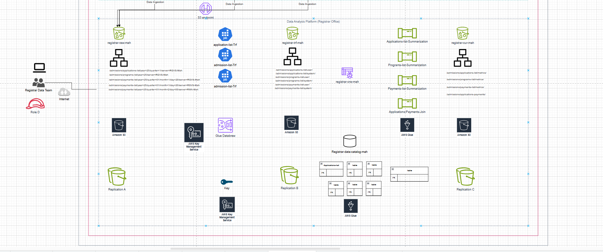

**What I Did**  
- **AWS Glue DataBrew**: Cleaned and standardized student data (dropped irrelevant columns, fixed data types)  
- **Glue Crawler & ETL**: Stored data in raw, transformed, and curated buckets in **S3**

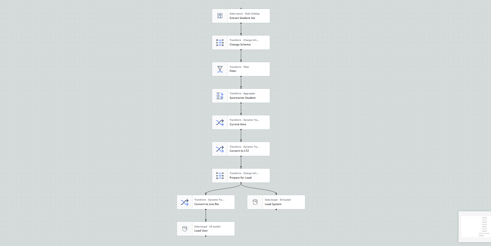

- **Consolidation**: Ensured consistent IDs and metrics to enable accurate academic standing checks

**Key Takeaways**  
- Streamlined the data preparation workflow  
- Organized data into distinct layers (raw, transformed, curated) for clarity

<!-- Insert a screenshot or diagram for Data Wrangling:

-->

---

## 5. Data Quality Control & Monitoring

### 5.1 Data Quality Control
**Project Description**: Implementing data governance checks for City of Vancouver  
**Objective**: Verify completeness, uniqueness, and freshness of water data before further analysis.

1. **Completeness**: `operating permit number` must be at least 95% populated  
2. **Uniqueness**: Turbidity values must be at least 99% unique  
3. **Freshness**: Exclude data older than 1000 days

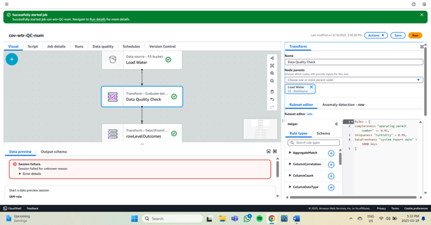

- **AWS Glue Visual ETL** pipeline splits data into “passed” or “failed” S3 buckets based on rules

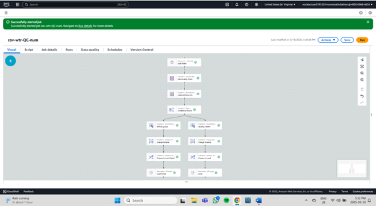

### 5.2 Monitoring with AWS CloudWatch
- **Dashboards**: Track S3 bucket size (raw vs. transformed)  
- **Alarms**: Trigger if usage exceeds 40,000 bytes

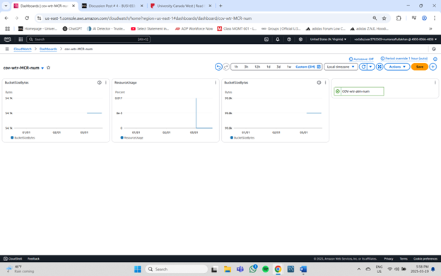

**Key Takeaways**  
- Automated data quality checks improve dataset reliability  
- Real-time monitoring allows rapid detection of anomalies

